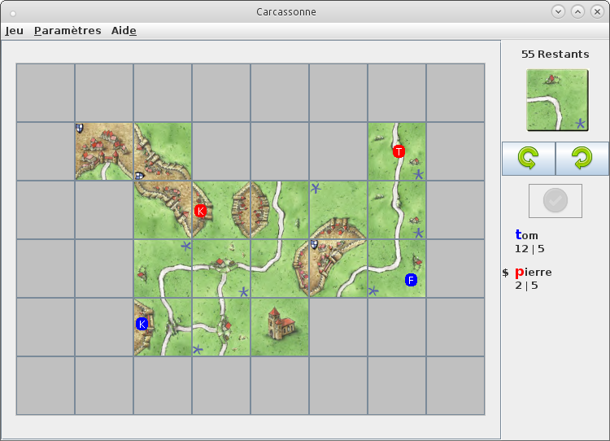

## Projet Carcassonne

### Composition du projet

- Moteur de jeu Carcassonne
- Interface graphique
- Système multijoueur
- Intégration lobby multijoueur dans l'interface graphique

## Instructions

Outils requis :

- Java 6.0 or later
- Ant
- JUnit

### Exécution et Compilation

La compilation se fait à l'aide de l'outil `Ant`.
Le fichier build.xml se trouve à la racine du projet.
Aller à la racine du projet et exécuter la commande : `ant execute`

Options :

- `ant execute` : exécute le programme
- `ant compile` : compile les sources
- `ant archive` : crée un .jar des .class après la compilation
- `ant clean` : efface tous les fichiers et dossiers qui ont été crés avec la commande '$ ant clean'
- `ant test-init` : crée des dossiers
- `ant test-compile` : compile les sources du test
- `ant test` : lance les tests
- `ant init` : crée des dossiers

